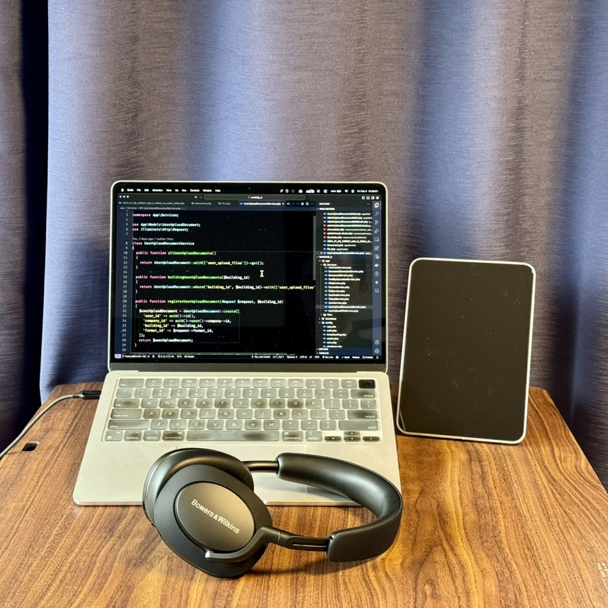
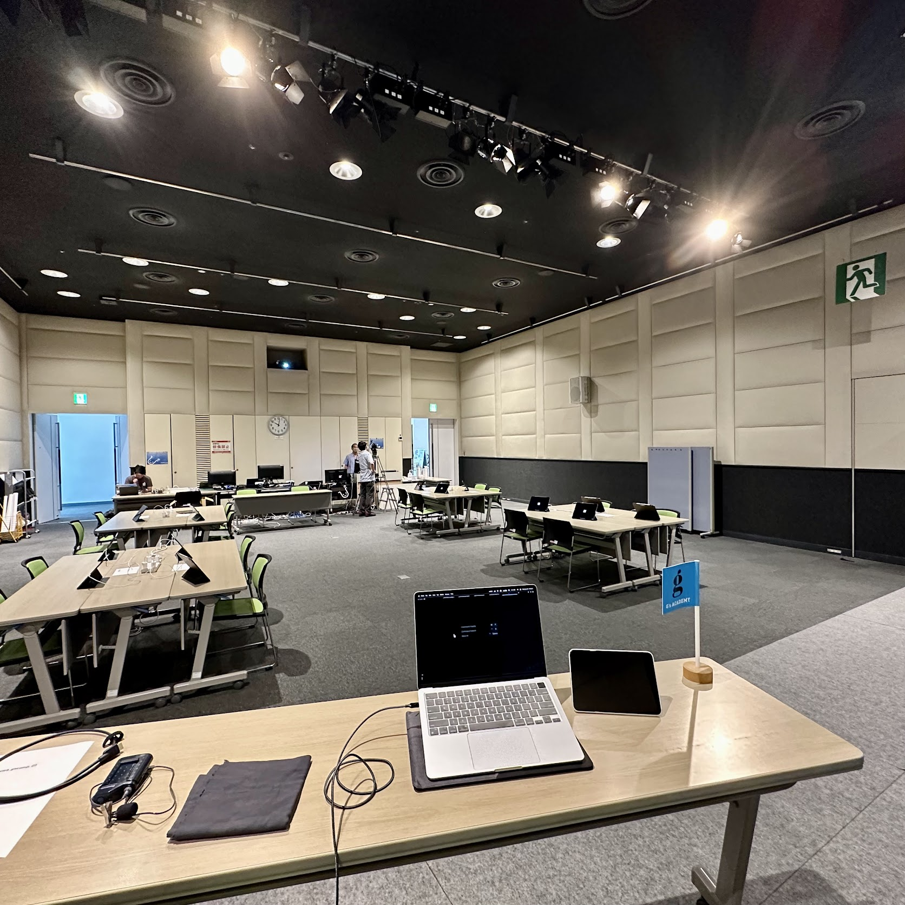
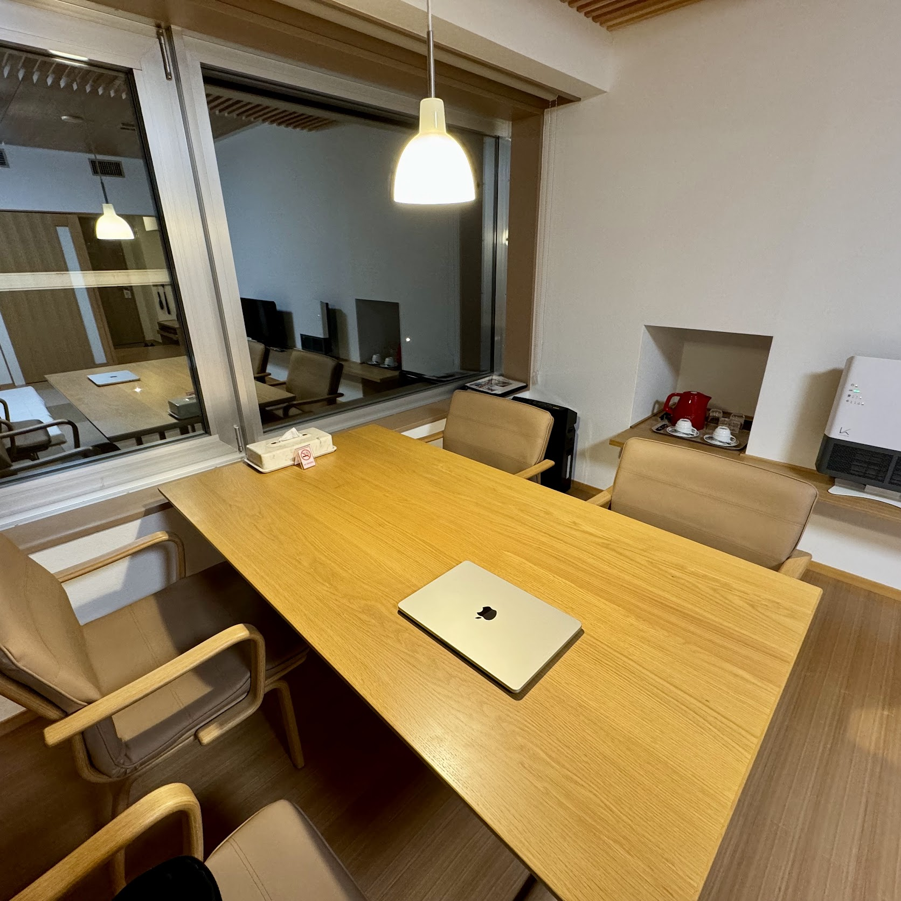
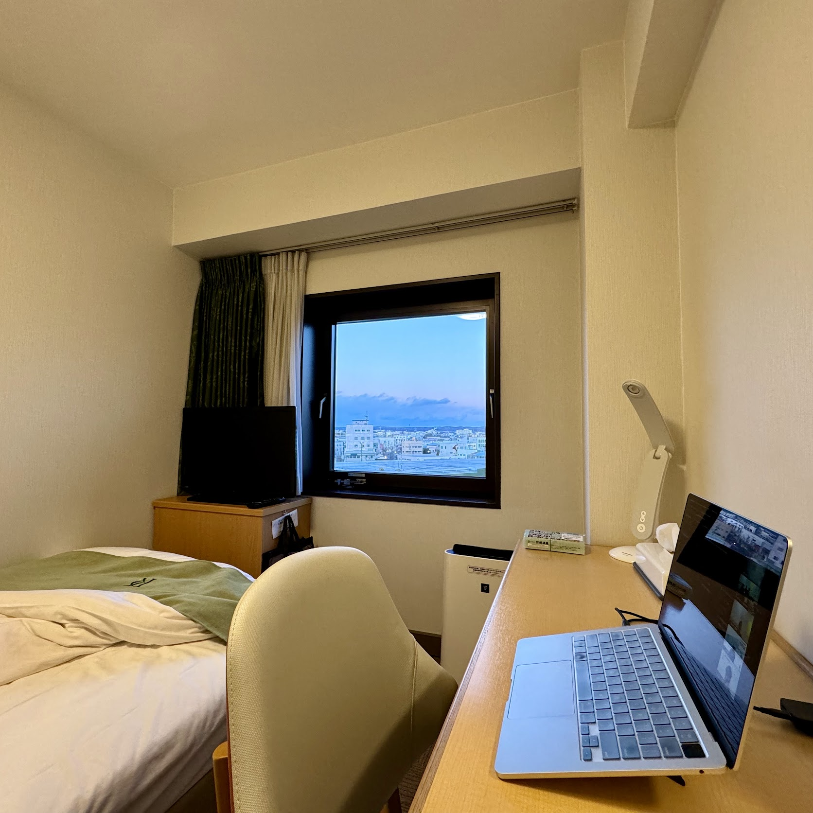
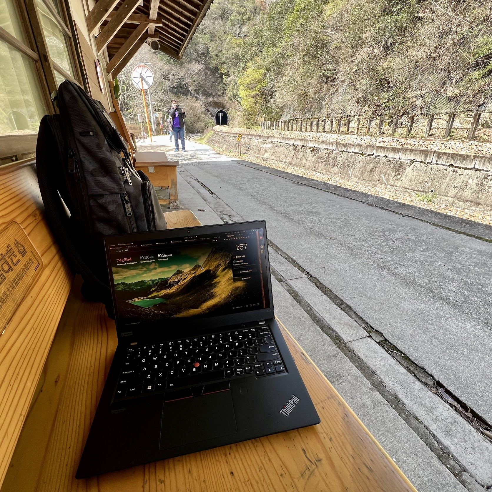

<!--
theme: gaia
class:
 - invert
headingDivider: 2
paginate: true
-->

<!--
_class:
 - lead
 - invert
-->

# 1 画面で生きる

トータルで考える

## 誰お前？

- 氏名: 大杉太郎
- Twitter: @tarosg
- 仕事:エンジニア，プログラミング講師
- 技術: Laravel，JS，Deno，（Rust）
- 好きなもの: 💻，📚，🥃，✈ 🚌 🚃，🚮


## 1 画面で生きる

<!--
_class:
 - lead
 - invert
-->

## 最近のデスク環境



## 機材

- MacBook Air (M2)
- ノイキャンヘッドホン（Bowers & Wilkins PX7SE2）
  - ↑ AirPods Pro の場合もあり
- （iPad mini）

## 画面数の議論ではない

画面数いくつがいいとかではない．

そもそも議論の余地はないッ！

- 27 インチ \* 2 マジ快適！
- 好きなキーボード使うの最高！
- マウスで大事なのはボタンの数！
- 左手デバイス！（使ってみたい）

## 1 画面で仕事してます！ ← なんでや

<!--
_class:
 - lead
 - invert
-->

## 自分が大事にしていること

**快適な環境 ≠ 仕事のパフォーマンス**

- 正確さ．
- スピード．
- **安定性．**

トータルでパフォーマンスが最大化する環境 is 何？

## 筆者の仕事（と環境）

- フルリモート．
- 旅するのが好き．

どこでもコード書くし，どこでも講義する．

**仕事の環境は行くまでわからん．その時いる場所が仕事場**

##



##





##



## 放浪する人の課題

**場所によってパフォーマンスが上下するのは良くない．**

- 荷物の量．
- バッテリー．
- デスクの環境変わりすぎ問題．

```
                 ＿人人人人人人人人人人人人人人人人＿
                 ＞　快適な環境を持ち歩くのは無理　＜
                 ￣Y^Y^Y^Y^Y^Y^Y^Y^Y^Y^Y^Y^Y^Y^￣
```

## 人間が合わせれば良い

→ じゃ家でもどこでも同じ環境で仕事すればよくね？

→ 常に MacBook 1 台で仕事すればどこ行っても同じや！

## まとめ

移動が多い人は 1 画面もあり．

- 画面数の議論ではない．
- 快適な環境 ≠ 仕事のパフォーマンス．
- 人間が合わせても結構慣れる．

**成果を出すための環境構築（物理）のも仕事のうち．**

# 🥃

<!--
_class:
 - lead
 - invert
-->

### Thanks!


